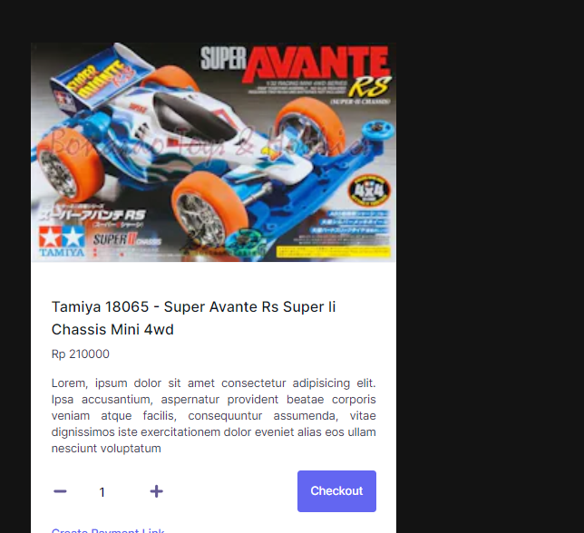
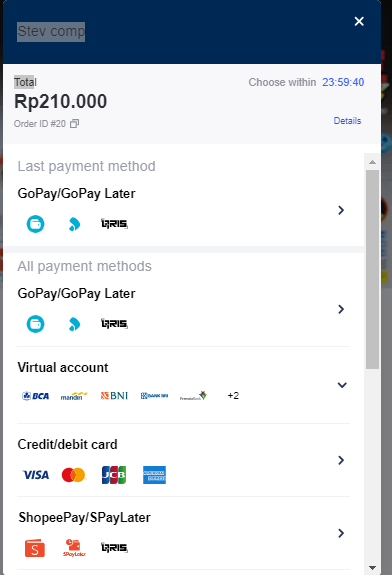

<div align="center" id="top"> 
 
 


  &#xa0;

  <!-- <a href="https://nextpay.netlify.app">Demo</a> -->
</div>

<h1 align="center"> Payment gateway</h1>


<!-- Status -->

<!-- <h4 align="center"> 
	🚧  Next Pay finish and success deploy
</h4> 

<hr> -->

<p align="center">
  <a href="#dart-about">About</a> &#xa0; | &#xa0; 
  <a href="#sparkles-features">Features</a> &#xa0; | &#xa0;
  <a href="#rocket-technologies">Technologies</a> &#xa0; | &#xa0;
  <a href="#white_check_mark-requirements">Requirements</a> &#xa0; | &#xa0;
  <a href="#checkered_flag-starting">Starting</a> &#xa0; | &#xa0;
  <a href="#memo-license">License</a> &#xa0; | &#xa0;
  <a href="https://github.com/{{YOUR_GITHUB_USERNAME}}" target="_blank">Author</a>
</p>

<br>

## :dart: About ##

membuat payment gateway dengan nextjs

## :sparkles: Features ##

:heavy_check_mark: Pembayaran melalui API mid trans \
:heavy_check_mark:  membuat  Payment Link 
:heavy_check_mark: Limit Waktu Pembayaran

## :rocket: Technologies ##

The following tools were used in this project:

- [Node.js](https://nodejs.org/en)
- [Next.Js](https://nextjs.org/)
- [Midtrans Payment Gateway](https://midtrans.com/)
- [React](https://react.dev/)
- [ngrok http tunnel](https://ngrok.com/)
- [vercel hosting ](https://vercel.com/)
  

## :white_check_mark: Requirements ##

Before starting :checkered_flag:, you need to have [Git](https://git-scm.com) and [Node](https://nodejs.org/en/) installed.

## :checkered_flag: Starting ##

```bash
# Clone this project
$ git clone https://github.com/StevanusAndika/Midtrans-Projek.git

# Access
$ cd Midtrans-Projek

# Install dependencies
$ yarn install or npm install

# Run the project
$ npm run dev or yarn run dev

# The server will initialize in the <http://localhost:3000>
